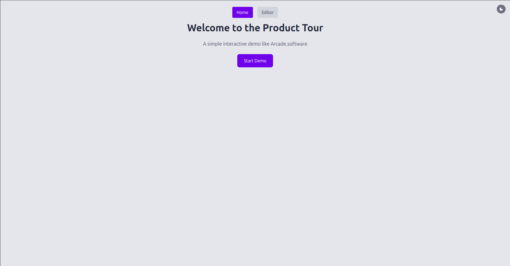

🎮 Arcade Tour Clone

Welcome to the Arcade Tour Clone repository! This project is a modern web application that replicates an immersive arcade tour experience, showcasing various arcade games and attractions. It demonstrates how to build interactive and visually appealing user interfaces using React, Vite, and Tailwind CSS.

🚀 Features

Responsive Design: Optimized for desktop and mobile devices.

Interactive UI: Smooth transitions and animations for an engaging user experience.

Modular Components: Reusable React components for scalability and cleaner code.

Modern Tooling: Built with Vite for fast development and Tailwind CSS for utility-first styling.

🛠️ Tech Stack

Frontend: React

Bundler: Vite

Styling: Tailwind CSS

Linting: ESLint

📦 Installation

To run the project locally:

git clone https://github.com/Kaushik-123-p/arcade-tour-clone.git

cd arcade-tour-clone

npm install

npm run dev

## 📸 Screenshots

